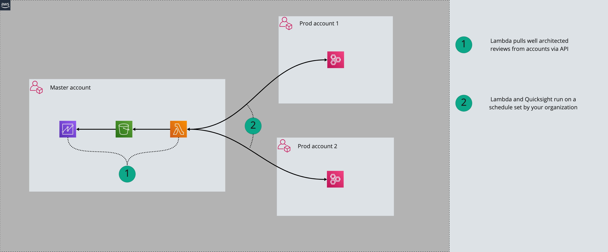

[![LinkedIn][linkedin-shield]][linkedin-url]

<!-- PROJECT LOGO -->
<br />
<p align="center">
  <a href="https://github.com/davidwebstar34/wellarchitected-reviewer">
    
  </a>

  <h3 align="center">Well architected reviewer</h3>

  <p align="center">
    <br />
    <a href="https://github.com/davidwebstar34/wellarchitected-reviewer/issues">Report Bug</a>
    ·
    <a href="https://github.com/davidwebstar34/wellarchitected-reviewer/issues">Request Feature</a>
  </p>
</p>


<!-- TABLE OF CONTENTS -->
<details open="open">
  <summary><h2 style="display: inline-block">Table of Contents</h2></summary>
  <ol>
    <li>
      <a href="#about-the-project">About The Project</a>
    </li>
    <li>
      <ul>
        <li><a href="#prerequisites">Prerequisites</a></li>
        <li><a href="#installation">Installation</a></li>
      </ul>
    </li>
    <li><a href="#contributing">Contributing</a></li>
    <li><a href="#license">License</a></li>
  </ol>
</details>


<!-- ABOUT THE PROJECT -->
## About The Project

Wellarchitected reviewer uses Lambda to publish results to a S3 bucket which is consumed by Quicksight using the AWS well architected API.


### Prerequisites

This is an example of how to list things you need to use the software and how to install them.
* nodejs14
  ```sh
  https://www.nodejs.org/
  ```

### Using

1. Create project using 
   ```sh
   npm install
   ```


<!-- CONTRIBUTING -->
## Contributing

Contributions are what make the open source community such an amazing place to be learn, inspire, and create. Any contributions you make are **greatly appreciated**.

1. Fork the Project
2. Create your Feature Branch (`git checkout -b feature/AmazingFeature`)
3. Commit your Changes (`git commit -m 'Add some AmazingFeature'`)
4. Push to the Branch (`git push origin feature/AmazingFeature`)
5. Open a Pull Request


<!-- LICENSE -->
## License

Distributed under the MIT License. See `LICENSE` for more information.


<!-- MARKDOWN LINKS & IMAGES -->
[linkedin-shield]: https://img.shields.io/badge/-LinkedIn-black.svg?style=for-the-badge&logo=linkedin&colorB=555
[linkedin-url]: https://www.linkedin.com/in/webstar/